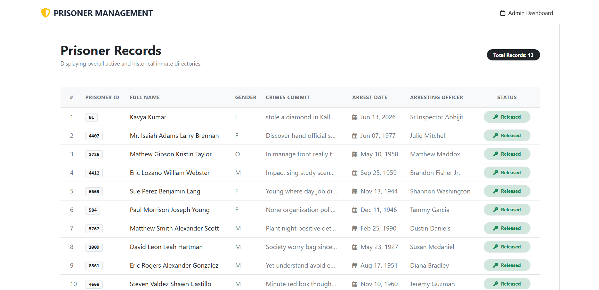

# 🏛️ Premium Prisoner Management System (Django ORM Mastery)

A highly polished, modern web dashboard built with Django and Bootstrap 5. This repository serves as a practical blueprint for mastering **Django Object-Relational Mapping (ORM)** operations and features an automated database populator tool using the `Faker` library.

---

## 📸 Interface Preview

---

## ⚡ Key Features

* **Automated Data Seeding:** Includes a robust standalone `populate.py` script powered by `Faker` to inject thousands of mock prisoner profiles instantly.
* **Django ORM Mastery:** Demonstrates advanced database queries including string lookups (`__icontains`), sorting (`order_by`), and filtering.
* **SaaS-inspired UI:** A clean dashboard designed with Google's `Inter` font, soft custom status badges (`Serving` vs `Released`), and fully responsive layouts.

---

## ⚙️ Core Django ORM Features Explored

Inside `views.py`, this project demonstrates various ways to query database records dynamically using Django's powerful ORM layer:

* **Fetch All Records:** `Prisoner.objects.all()`
* **Exact Filtering:** `Prisoner.objects.filter(first_name='Kavya')`
* **Case-Insensitive Search:** `Prisoner.objects.filter(crimes__icontains='murder')`
* **Ascending Order:** `Prisoner.objects.order_by('id')`
* **Descending Order:** `Prisoner.objects.order_by('-id')`

---

## 📊 Database Seeding Automation (`populate.py`)

No need to enter records manually via the Django Admin panel. The built-in automation script bypasses the standard server and speaks directly with the Django ORM to generate massive mock datasets safely using `get_or_create`.

### How to seed your database:
In Terminal
>>> python populate.py

# Interaction Example:

Enter number of Prisoner : 50
50 Record inserted successfully!

